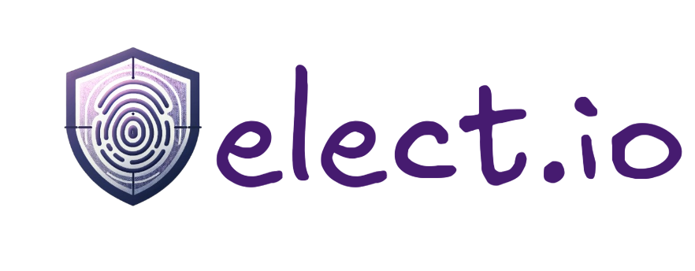

# elect.io: the next-gen decentralized voting platform 🗳️


elect.io revolutionizes digital voting by combining the security of Solana blockchain with an intuitive user experience. Built for organizations, institutions, and communities that value transparency and trust.


## ✨ Features

- **Real-Time Results** - Watch votes flow in as they happen
- **Bank-Grade Security** - Powered by Solana blockchain and QuickNode infrastructure
- **Universal Access** - Vote from any device, anywhere in the world
- **Tamper-Proof** - Every vote is permanently recorded on the blockchain
- **Role-Based Access** - Flexible voter verification system
- **Instant Analytics** - Track participation and results in real-time

## 🚀 Quick Start
See [Technical Setup](#prerequisites) for more details

### For Voters

1. Connect your Solana wallet
2. Complete one-time verification
3. Start voting in available elections!

[IMAGE: Screenshot of the voter onboarding flow]

### For Election Organizers

1. Create your election at  `/election/create`
2. Add candidate and candidate details
3. Set up voter verification requirements
4. Launch your first election


## 🛠️ Technical Setup

### Prerequisites

- Node.js v16+
- Solana CLI tools
- QuickNode account
- ngrok (for local development)

### Local Development

```bash
# Clone the repository
git clone https://github.com/dvrvsimi/vote-dapp
cd vote-dapp

# Install dependencies
npm install

# Start the development server
npm run dev
```


## WebSocket Streams


Below are the list of available streamable channels
- `elections`: Track election lifecycle events
- `votes`: Monitor incoming votes
- `voters`: Follow voter registration
- `users`: Track user verification events

## 📊 Dashboard Features


- Real-time vote counting
- Voter turnout analytics
- Geographic distribution
- Time-based participation trends

## 🔒 Security Features

- Solana blockchain integration
- QuickNode infrastructure
- Role-based access control
- Multi-factor authentication
- Real-time rig detection

## 🌟 Use Cases

- **Corporate Governance**
  - Shareholder voting
  - Board elections
  
- **Academic Institutions**
  - Student government
  - Faculty senate
  
- **Organizations**
  - Member voting
  - Leadership elections


## 💡 Contributing

contributions and suggestions are very welcome.


## 🚀 Deploy Your Own

### QuickNode Setup

1. Create your QuickNode account
2. Configure Solana endpoint to devnet
3. Set up Streams with our template (see webhook folder for both `filter.js` and `server.js`)


### Program Configuration

Monitor these Solana program events:
- Election initialization
- Voter registration
- Vote casting
- Election completion

## 📄 License

Elect.io is licensed under the MIT License. See [LICENSE](LICENSE) for details.

---

<div align="center">
  


Built with ❤️ by dvrvsimi

</div>